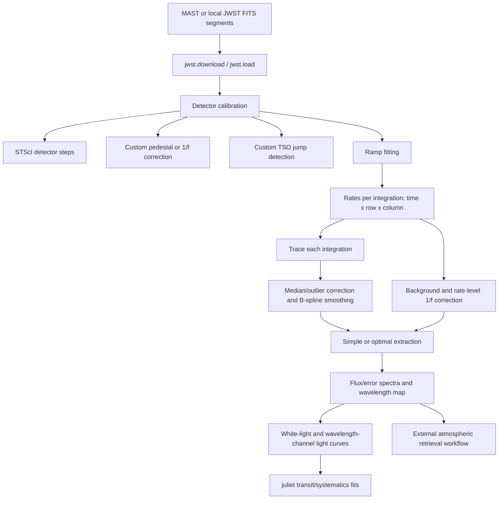

# TransitSpectroscopy codebase report

## Scope and audit basis

This report describes the repository at commit `8458f6b` on the `dev-codex-upgrades` branch, with package version `0.4.1`. It is based on a static review of every non-Git file in the repository: the Python package, both C extensions, packaging and release files, example scripts, four notebooks, the banner image, the C editor swap file, the changelog, README, license, and shell release helper. I also compared the implementation with the data-reduction and analysis description in [Espinoza et al. (2025), arXiv:2509.05414](https://arxiv.org/abs/2509.05414), especially Appendix A.1.

No pipeline, numerical fit, C build, or scientific-data reduction was run. The findings about defects and risk come from source inspection and a read-only `pyflakes` pass. This matters because the repository has example scripts rather than an automated test suite, the optimal-extraction extension is disabled in the package build, and several workflows need external JWST data, CRDS reference data, MAST access, or optional packages.

## Executive assessment

`transitspectroscopy` is a research-oriented toolkit that spans much of a transit-spectroscopy workflow:

1. download JWST products from MAST;
2. load segmented JWST time-series observations and preserve their datamodel metadata;
3. perform selected detector-level calibration steps, including custom reference/pedestal, 1/f, and jump treatments;
4. fit detector ramps to rates per integration;
5. trace a dispersed spectrum in each integration;
6. perform fractional-aperture or Marsh-style optimal extraction;
7. build wavelength and white-light products;
8. fit independent light curves through `juliet`, optionally with GP and linear regressors;
9. supply small astronomy, statistics, coordinate, binning, and time-series helpers.

The strongest part of the library is the collection of domain algorithms and the end-to-end JWST examples. The custom TSO jump detector, detector-noise models, trace finder, and extraction code encode substantial practical knowledge. The paper demonstrates that the central PRISM workflow can produce science-grade results whose relative transmission spectra agree with independent pipelines.

The repository is not currently a self-contained, reproducible pipeline in the software-engineering sense. Important dependencies are undeclared, two nominally optional imports can prevent the whole package from importing, output caching has no configuration provenance, and several public or semi-public paths are unfinished or contain clear runtime errors. The `retrievals` module is a scaffold rather than a functioning retrieval engine. The old `stage1`/`stage2` procedural workflow and the newer `jwst.load` object workflow overlap without a single authoritative contract.

The safest future direction is to retain every current public name, signature, dictionary key, filename convention, and legacy C entry point as a compatibility facade while moving implementation into small private modules. New typed configuration and result objects can be additive views over the existing dictionaries. Defect fixes should be tested against legacy outputs and released as patch changes; changes to scientifically meaningful defaults should be opt-in until a major version.

## Conceptual architecture and data flow



The repository directly implements A through L in varying degrees. It does not implement the atmospheric GP retrieval used for the paper’s final atmospheric constraints; the `retrievals.py` file is incomplete and not connected to a forward model or sampler.

The core array conventions are:

| Product | Shape or form | Meaning |
|---|---:|---|
| JWST ramps | `(integration, group, row, column)` | Group-level detector samples |
| Rates / TSO | `(integration, row, column)` | Ramp-fit rates per integration |
| Trace | `x: (column,)`, `y: (column,)` or `(integration, column)` | Cross-dispersion center at each detector column |
| Extracted spectra | `(integration, column)` | Flux and error at each dispersion pixel |
| Marsh profile `P` | `(row, column)` | Normalized spatial light fraction in the aperture |
| Marsh spectrum | `(3, column)` | Column index, flux, and inverse variance |
| Light-curve input | dict with `times`, `flux`, `error` | Optional GP and linear external-parameter arrays |
| Stage output | nested Python dictionaries | Metadata, arrays, traces, spectra, and white light |

## Packaging, imports, and effective public API

`setup.py` installs the `src` directory as the `transitspectroscopy` package and compiles the top-level extension module `CCF`. It reads version `0.4.1` from `src/_version.py`. The declared runtime dependencies are NumPy, SciPy, `jwst`, Astropy, `jdcal`, and `tqdm`.

There are several important qualifications:

- `src/__init__.py` eagerly star-imports `spectroscopy`, `transitfitting`, `utils`, and `jwst`. This creates a broad, accidental top-level API and makes import cost and dependency availability global concerns.
- `transitfitting.py` imports `juliet` unconditionally. `juliet` is not in `install_requires`.
- `transitfitting.py` describes Ray as optional, but applies `@ray.remote` unconditionally. If Ray is absent, module import fails after printing the optional-dependency warning. Ray is also undeclared.
- `jwst.py` optionally imports `astroquery.mast.Observations`, but `download()` cannot work without it. `astroquery`, pandas, Ray, and GWCS are used directly and are not independently declared; some may arrive transitively through `jwst`, but that is not a stable package contract.
- The `Marsh` extension is commented out in `setup.py`, matching the 0.4.1 changelog. Consequently, `getP`, `getOptimalSpectrum`, and `getFastSimpleSpectrum` are installed as Python functions but cannot perform their work through a normal 0.4.1 installation unless a user separately builds or supplies a compatible `Marsh` module.
- The README still says GSL is required for installation. That was true for the Marsh extension, but the only currently built C extension links only against `libm`; the documentation and build configuration have diverged.
- `retrievals.py` is not imported by the package initializer. `timeseries.py` is imported indirectly by `jwst.py`, but is not listed in package `__all__`.
- The module-level star imports also expose imported helpers and modules unintentionally. Existing users may nevertheless rely on this namespace, so cleanup must preserve aliases.

The intended public surface, inferred from docstrings, notebooks, and the changelog, is broader than `__all__` and includes the following.

### `spectroscopy.py`

#### `getP(...)`

Builds the spatial light-fraction image used for optimal extraction. It flattens a two-dimensional spectrum, passes sampled trace centroids and detector/noise parameters to `Marsh.ObtainP`, or to `Marsh.SObtainP` when a variance image is supplied, and reshapes the returned list to the original image dimensions. `return_flat=True` retains the C-compatible flat layout.

Despite the C comments calling the trace vector “coefficients,” the current C `Trace()` routine directly indexes it by detector column. The Python caller therefore correctly treats `centroids` as one center value per column, not polynomial coefficients.

When `data_variance` is supplied, the wrapper also passes an all-ones validity image and the explicit variance image; read noise and gain then have no numerical effect. The caller is responsible for double-compatible, correctly sized centroids. The wrapper casts flattened data and variance but does not cast or validate centroids.

#### `getOptimalSpectrum(...)`

Computes `P` unless a precomputed profile is supplied, then calls the variance-aware or detector-noise-aware C extractor. It returns a `(3, ncolumns)` array containing column indices, optimally weighted flux, and inverse variance. `return_P=True` adds the reshaped spatial profile. Reusing a common `P` is the intended acceleration for a time series.

#### `getFastSimpleSpectrum(...)`

Calls the C extension’s fractional-pixel aperture sum. It returns a flux vector and can also report an aperture that the C routine reduced to keep all trace apertures on the detector. Like the other two functions, it currently depends on the disabled `Marsh` extension.

#### `getSimpleSpectrum(...)`

Implements aperture extraction in Python. For each requested detector column it:

- samples a trace-centered interval;
- optionally estimates a median background above, below, or on both sides of the aperture;
- accounts for fractional coverage at the two aperture edges;
- sums the included pixels and propagates input pixel variances, or averages the fully included pixels when `method='average'` (used for wavelength maps).

The background subtraction is done in-place on the selected column view, so `correct_bkg=True` modifies the caller’s `data` array. That side effect is undocumented and should be treated as current behavior until a compatibility plan is chosen. The upper background slice also omits the final detector row.

#### Profile and correlation helpers

- `gaussian()` evaluates a normalized Gaussian.
- `double_gaussian()` sums two normalized Gaussians, with default separation tuned for the two NIRISS/SOSS horns.
- `get_ccf_convolve()` constructs an Astropy Gaussian or double-Gaussian kernel and performs FFT convolution. It is the practical tracing method used by current notebooks.
- `get_ccf()` evaluates correlations over a fine lag grid through C functions for a Gaussian, double Gaussian, or an arbitrary Python-evaluated profile. Its `pixelation` parameter is accepted but unused.
- `get_pm_ccf()` is intended to compare two differently sampled series by interpolation and either absolute differences or a standard product correlation. It currently refers to an undefined `interpolate` module even though `interp1d` was imported directly, so it fails when called.

#### `trace_spectrum(...)`

Traces columns in either direction from `(xstart, ystart)`. Each detector column is median-filtered, DQ/nonfinite/outlier pixels are replaced by the filter, and the background median is removed. Within `profile_radius` it finds the trace center by C correlation, FFT convolution plus bounded cubic interpolation, or a flux centroid. A jump larger than `y_tolerance` is replaced by the previous center.

In all repository uses, `xend` is supplied. If it is omitted as the docstring permits, `indexes` and `direction` are never initialized. A completely bad first column can likewise use `previous_trace` before assignment. The `status` vector is built but never returned, and the invalid-method error omits the supported `convolve` mode.

#### Width and robust-scatter helpers

- `get_fwhm()` spline-interpolates a profile minus half maximum and returns the separation of exactly two roots, otherwise zero.
- `trace_fwhm()` applies that measurement across a TSO and returns both the full `(time, detector-column)` width array and a median, column-normalized width time series.
- `get_mad_sigma()` returns `1.4826 * MAD` using a computed median.

### `timeseries.py`

`outlier_detector()` subtracts a median-filtered time series, estimates scatter through the utility-module MAD function, and returns indices beyond `nsigma`; it can also return the filter. This is used by both TSO jump detection and trace cleanup. A zero-MAD series has no explicit fallback, so a single nonzero residual can be classified against a zero threshold.

### `utils.py`

The module contains independent astronomy/statistics helpers:

| Function | Current behavior |
|---|---|
| `get_scaleheight` | Computes equilibrium temperature, gravity, and atmospheric scale height in km from Jupiter-unit planet properties and `a/R*`. |
| `get_transpec_signal` | Converts one scale height into a transmission amplitude in ppm using stellar radius in solar units. |
| `get_phases` | Wraps times to `[-0.5, 0.5)` using median period and epoch; scalar handling relies on `type(t) is float`. |
| `function_quantiles` | Calls `get_quantiles` independently at every model coordinate. |
| `get_quantiles` | Sorts a distribution and returns a median-like center and bounds; its even-sample indices are off by one and bound indices can exceed the array. |
| `fit_spline` | Fits a SciPy B-spline with explicit knots, evenly spaced knots, or per-region knot counts. If neither knot argument is supplied, `knots` is undefined. |
| `get_mad_sigma` | Returns `1.4826 * median(abs(x - supplied_median))`. This has a different signature from the function of the same name in `spectroscopy.py`. |
| coordinate helpers | Convert RA/Dec strings and degrees. Negative declinations between -1 and 0 degrees lose their sign in `deg_to_coords`. |
| `mag_to_flux` | Monte Carlo converts magnitudes to relative flux and error; it uses divisor 2.51 and the global random state. |
| `getCalDay` | Converts JD to calendar pieces using `jdcal`. |
| `transit_predictor` | Finds and prints events within a day/month and returns ingress, center, and egress JDs. Its event-discovery checks add/subtract `tduration/2` directly to JD even though duration is documented in hours; returned ingress/egress correctly divide by 24. |
| `bin_at_resolution` | Sorts wavelengths and accumulates points until a bin reaches the target resolving power. It uses a mean or median wavelength only for the stopping calculation, always reports the mean wavelength, uses inverse-variance weighting when errors exist, and otherwise reports a standard error from within-bin scatter. An incomplete final bin, including a single-point input, is dropped. |
| air/vacuum conversion | Applies the Morton-style refractive-index formula to micron inputs. |
| `chi_square_test` | Returns the upper-tail chi-square p-value for a supplied model and parameter count. |

### `transitfitting.py`

This module adapts dictionary inputs to `juliet` light-curve datasets. Every individual data dictionary must contain `times`, `flux`, and `error`; it may additionally contain `GP_external_parameters` and/or `linear_external_parameters`. The adapter always names the internal instrument `SOSS`, regardless of the actual instrument.

- `notremote_fit_data()` creates a `juliet` dataset in one of four regressor combinations, runs the requested sampler, and returns the fit result.
- `fit_data()` duplicates the same logic under a Ray decorator, but does not return `dataset.fit(...)`. Parallel `fit_lightcurves()` therefore records `None` for each fit even if the remote work completes.
- `fit_lightcurves()` dispatches independent wavelength-bin fits serially or through Ray. Output folders are set directly to dictionary keys. It initializes but does not shut down Ray.

The paper’s use of quadratic limb darkening, celerite-compatible GP regressors, jitter, and dynamic nested sampling can be expressed through `juliet`, but most of those scientific choices are supplied by caller-defined priors and keyword arguments rather than implemented here.

### `retrievals.py`

This is an unfinished retrieval-data abstraction:

- `load` is intended to read priors and instrument-keyed wavelength/depth/error dictionaries, normalize wavelength centers into bin bounds, serialize them, and construct a `fit` object.
- instrument names are inferred only from prior keys containing `offset_`;
- `fit` stores the sampler name and input data but implements no likelihood, forward model, priors, sampling, or outputs.

Several paths are currently unusable. `read_priors()` never breaks at EOF, blank lines are unsafe, and parsed starting points are discarded. Initializing from a prior filename passes the original filename string to `set_parameters()` instead of the parsed dictionary. The one-dimensional wavelength conversion repeatedly writes rows 0 and 1 rather than row `i`. `save()` neither creates a missing output directory nor correctly formats its data rows; it calls `.keys()` on a list and refers to an undefined `priors`. `resolution` is accepted but never stored or used. This module should not be represented as implementing the atmospheric retrieval in the linked paper.

### `jwst.py`: data access and stateful dataset API

#### `download(...)`

Queries MAST by JWST proposal and observation number, filters products, downloads them, moves FITS files out of MAST’s nested download tree, inspects datamodel metadata, and prints a pandas table. Proprietary products can use a MAST token.

The accepted product list contains `RAMPS`, while the selection branch checks `RAMP`; neither spelling can successfully select ramp products. The function has no explicit return value. It assumes at least one downloaded datamodel when printing observation metadata and does not explicitly close opened models.

#### `jwst.load`

The lowercase `load` class is a mutable dataset/workflow object. Construction:

1. creates or selects an output directory and immediately creates `ts_outputs`;
2. classifies filenames as ramps or rates from suffixes;
3. sorts `-segNNN` names chronologically;
4. opens every segment as a JWST datamodel;
5. concatenates BJD TDB integration times;
6. reads calibration status and determines one of NIRSpec/PRISM, NIRSpec/G395H, NIRSpec/G395M, NIRISS/SOSS, or MIRI photometry modes;
7. merges segment arrays into contiguous `ramps` or `rateints` arrays and then points each segment datamodel back into the corresponding slice.

This shared-memory relinking is deliberate and documented in the tutorials: edits through the combined array are reflected in per-segment products used by later pipeline steps. It is useful but makes copying and mutation semantics central to compatibility.

The loader assumes segmented JWST filename structure even for a single file. The MIRI-mode test uses identity comparison with the string `'None'`, which is unreliable. Filters are lowercased without guarding against `None`.

#### Calibration orchestration

`check_status()` mirrors relevant JWST calibration metadata, records instrument mode, and accounts for the introduction of MIRI `emicorr` in newer pipeline versions.

`fill_calibration_parameters()` creates per-step parameter dictionaries, records skip choices, configures saved output names, and installs mode defaults for PRISM reference columns, tracing, and jump detection. TSO-jump defaults are a 200-integration window for PRISM and 10 for other recognized modes, at 10 MAD sigmas. User dictionaries can be mutated because nested values are assigned by reference.

`detector_calibration()` runs or reloads detector steps. For NIRSpec/PRISM it replaces the standard reference-pixel correction with a scalar pedestal estimated from the leftmost and rightmost 25 columns. An optional group-level 1/f operation acts on all segments together. It then runs dark subtraction and either the custom TSO jump detector or the pipeline jump step, saves/reloads products by filename, records pipeline and CRDS versions, and remerges segment arrays.

`fit_ramps()` calls the JWST ramp-fitting step per segment, selects the integration-level output, records provenance, and merges it. Running it directly before any step has established a suffix can fail because the default `suffix=None` is treated as a nonempty string during initialization.

`trace_spectra()` is unfinished. Its helper `interpolate_nans()` also contains three direct name errors (`copy.deepcopy` even though `copy` is imported as a function, `median_rate`, and `nan_locations`). Users currently trace through the procedural `stage2()` function instead.

#### Detector and time-series algorithms

`side_refpix_correction()` removes one median pedestal per integration/group using edge columns and marks the refpix step complete.

`group_1f_correction()` builds a median last-minus-first image over all segments, median-filters it, centroid-masks the spectrum, and subtracts the median of unmasked rows from every detector column in every group. Its `npixel` and `nsigma` arguments are unused, and the row/column window names appear reversed relative to the array order passed to `median_filter`.

`tso_jumpstep()` concatenates group-difference time series conceptually across all segments. For every detector pixel and adjacent group pair, it median-filters values across integrations, uses MAD scatter to identify outliers, maps those integrations back to segments, and writes DQ value `4` at group `g+1`. It deep-copies `groupdq` but otherwise shallow-copies datamodels. Assignment replaces existing DQ bits rather than combining the jump bit with bitwise OR.

`cc_uniluminated_outliers()` refines a supplied background mask by rejecting column-wise MAD outliers.

`get_roeba()` creates a simple row-odd/even plus per-column median model on unilluminated pixels.

`get_loom()` solves a least-squares model with odd-row offset, even-row offset, and an offset for every column, optionally adding a scaled background template. The parameterization is degenerate by an additive constant, but LSMR selects a solution and the summed image model can still be identified. The dense normal matrix scales as roughly `(ncolumns + 3)^2`.

`download_reference_file()` obtains a CRDS file through Astropy’s cache and renames the cached path into the current directory, which can disrupt the cache rather than copy from it.

`get_last_minus_first()` subtracts the per-frame median from selected first and last groups before differencing them, returning all integrations and optionally their median.

`spill_filter()` expands illuminated/bad mask regions when their local box has enough zeros. `get_uniluminated_mask()` identifies high pixels relative to each column’s median/MAD, recursively refines the mask once, and spills it. When `pixeldq=None`, it later references `idx_bad_pixels` before assignment.

`get_cds()` returns adjacent-group differences for one or more RampModels. Its timestamp calculation converts the initial frame time to days but then adds subsequent group and frame times in seconds directly to a Julian date; the returned times are therefore incorrect.

`correct_1f()` subtracts a scaled median/template spectrum, masks an annulus around the trace in that residual, takes a per-column median as a detector pattern, and removes it from the original frame. It can also return the masked residual detector image.

`cds_stage1()` is an experimental CDS route for NIRSpec/G395H and NIRISS/SOSS. It reads ramps, differences groups, traces and spline-smooths a median image, estimates background and 1/f structure, creates a preliminary white-light curve, and returns corrected CDS data. The NIRISS mode comparison omits the call to `.lower()`, `sys` is not imported on the failure path, second-order trace cleanup mixes the first-order arrays and indices, and the background model/mask inputs are unused. It should be considered prototype code.

### `jwst.py`: legacy procedural Stage 1

`stage1()` is an older monolithic route from `*uncal.fits` files to jump-step and integration-rate datamodels. It supports NIRSpec PRISM/G395H/G395M in the actual mode dispatch. It runs or reloads:

1. DQ initialization;
2. saturation, optionally with an override reference;
3. superbias, optionally overridden;
4. the custom PRISM edge-column pedestal or the normal reference-pixel step;
5. linearity, optionally overridden;
6. custom TSO or pipeline jump detection;
7. JWST ramp fitting.

It writes intermediate FITS products under `pipeline_outputs`, then returns:

```text
{
  'times': BJD_TDB array,
  'ints_per_segment': array,
  'nints': metadata value,
  'ngroups': metadata value,
  'rampstep': [rate-integration datamodels],
  'jumpstep': [ramp datamodels],
  'metadata': {
      instrument fields, observation dates,
      calwebb_version, param_context
  }
}
```

The function name is potentially confusing because its `rampstep` value is the second, integration-rate output of JWST ramp fitting. File-reuse checks depend only on path/suffix and do not confirm that current arguments, pipeline version, CRDS context, input files, or reference overrides match the cached product.

### `jwst.py`: procedural Stage 2

`stage2()` consumes the dictionary above. Its current effective scope is NIRSpec PRISM and G395H/G395M. It:

1. merges rates, DQ, and errors across segments into time-major cubes;
2. replaces nonfinite pixels, and optionally all nonzero DQ pixels, with zero or a filtered median image;
3. determines a hard-coded detector/mode trace range and initial profile region;
4. uses the C `get_ccf()` function to find the starting center, then generally traces by FFT convolution with a Gaussian;
5. traces every integration serially or with Ray;
6. median-filter-corrects trace outliers and B-spline-smooths every trace;
7. selects the median trace or each integration’s trace;
8. optionally subtracts a column background and a scaled-template 1/f model;
9. performs simple or optimal extraction;
10. replaces 5-sigma spectral-column outliers with a scaled master spectrum;
11. asks the JWST WCS machinery for a wavelength image and aperture-averages it;
12. serializes trace and spectrum dictionaries with pickle;
13. returns normalized white-light flux and propagated error.

The result has this practical form:

```text
{
  'metadata': instrument/filter/grating/detector/subarray,
  'tso': (time, row, column),
  'tso_err': (time, row, column),
  'traces': {
      'times', 'x', 'y', 'ycorrected', 'ysmoothed'
  },
  'spectra': {
      'times', 'original', 'original_err',
      'corrected', 'corrected_err',
      'wavelength_map', 'wavelengths',
      and, for optimal extraction, 'Ps', 'P'
  },
  'whitelight': normalized vector,
  'whitelight_err': normalized vector
}
```

Two availability issues affect the default path. The initial center always calls the `CCF` extension even though subsequent tracing defaults to convolution, so CCF is effectively required for Stage 2 despite its optional-import warning. Optimal extraction calls `Marsh`, which a normal 0.4.1 build does not produce.

With `zero_nans=False`, `median_rate_err` is used without ever being assigned; only `median_rate_err_nan` is assigned. The mode geometry, spline knots, Gaussian width, background choice, 1/f windows, and optimal-extraction parameters are mostly hard-coded. Keyword arguments are accepted but do not provide a general configuration path. The pickle cache has the same stale-result risk as Stage 1 and is unsafe to load from untrusted locations.

## Relationship to the 2025 TRAPPIST-1 e paper

The paper is valuable evidence about intended use, but it should not be interpreted as a specification that every step exists in this exact checkout.

The direct correspondences are strong:

| Paper procedure | Repository implementation |
|---|---|
| Start from `*uncal.fits` and use JWST detector/ramp steps | `jwst.stage1()` and `jwst.load.detector_calibration()` / `.fit_ramps()` |
| Lower saturation threshold through an override reference | `override_saturation` in legacy `stage1`; arbitrary step parameters in the object API |
| Skip dark correction for short PRISM ramps | Possible through object API `parameters['skip']`; legacy `stage1()` does not run dark subtraction |
| Remove group pedestal from left/right 25 columns | `side_refpix_correction()` and duplicated logic in legacy `stage1()` |
| Custom time-series jump finding with a 200-integration median window and 10-MAD-sigma cutoff | `tso_jumpstep()` and PRISM defaults |
| JWST ramp fitting | `fit_ramps()` or the end of `stage1()` |
| Gaussian cross-correlation trace per column | `get_ccf()`, `get_ccf_convolve()`, and `trace_spectrum()` |
| Eight-knot B-spline over the PRISM trace | PRISM branch of `stage2()` |
| Median of integration-level traces | `single_trace_extraction=True` in `stage2()` |
| Rate-level background and scaled-template 1/f treatment | background block plus `correct_1f()` in `stage2()` |
| Simple extraction | `getSimpleSpectrum()` and default `optimal_extraction=False` |
| `juliet` wavelength-dependent fits with GP/jitter supplied by priors | `transitfitting.py` adapter and direct `juliet` use in tutorials |

The paper’s NE reduction used JWST Calibration Pipeline 1.12.5, a modified 90%-saturation reference, group-level column background from two pixels at each top/bottom edge, simple extraction with radius 7, time binning by ten, quadratic limb-darkening values based on PHOENIX/MC-SPAM, and a Matérn-3/2 GP with wavelength-specific amplitude and visit-specific fixed time scale. The AG reduction used the default saturation reference and radius 10, did not bin in time, fixed GP amplitude, and fitted GP time scale.

Several of those are caller configuration or notebook-level analysis rather than stable library settings. In this checkout, PRISM Stage 2 defaults to radius 10 and explicitly disables its rate-level background subtraction. The exact paper statement about removing a group-level per-column background from the top and bottom two pixels is not a clearly selectable operation in the legacy `stage1()`; `group_1f_correction()` is related but uses a trace-derived mask and is off by default in the object API. Reproducing the paper therefore requires an external run configuration and possibly code/version context not preserved here.

The paper reports that five reductions across `transitspectroscopy`, Eureka!, and ExoTiC produced consistent relative transmission spectra, with pairwise chi-square p-values above 0.4. That is strong validation of the scientific shape recovered by the reduction used for the paper. It does not validate every current function or current default.

The paper’s spectral atmospheric inference is also separate from this repository. It jointly models visit-varying stellar contamination with Gaussian processes while treating a shared signal as planetary, and compares atmospheric scenarios. The local `retrievals.py` has none of that machinery. Its conclusions about ruling out cloudy H2-dominated atmospheres should be attributed to the paper’s external retrieval framework and data products, not to the unfinished class in this package.

## The C optimal-extraction implementation

### Build and Python boundary

`src/c-code/OptimalExtraction/Marsh.c` is a CPython/NumPy extension written originally in 2011–2012 and linked to GSL for QR solution of dense linear systems. It exports:

- `ObtainP`: derive spatial light fractions from data and a detector noise model;
- `SObtainP`: derive them using an explicit variance image and a validity image;
- `ObtainSpectrum`: optimally extract with the detector noise model;
- `SObtainSpectrum`: optimally extract with an explicit variance/validity image;
- `BObtainSpectrum`: extract the science image and a second matched image using the same weights;
- `SimpleExtraction`: fast fractional-aperture sum.

Only the first, second, third, fourth, and simple routines have Python wrappers in `spectroscopy.py`; the background/second-image `BObtainSpectrum` entry point is not wrapped there. The C module is currently excluded from `setup.py`.

The boundary assumes C-contiguous `float64` NumPy arrays and manually supplied lengths. It reads `PyArrayObject->data` directly, does not validate dtype, dimensionality, contiguity, lengths, allocation success, or the success of `PyArg_ParseTuple`, and does not initialize/use the NumPy C API in the conventional way. The Python wrapper makes data, variance, and `P` flat `double` arrays, but leaves centroids unchecked. Bad inputs can therefore produce incorrect reads or process-level memory errors rather than Python exceptions.

### Profile model (`ObtainP` / `SObtainP`)

For an image whose Python layout is `(row, column)`, the implementation internally transposes to a column-major conceptual matrix `A[j][i]`, where `j` is dispersion column and `i` is cross-dispersion row.

The algorithm proceeds as follows:

1. **Aperture adjustment.** `CheckAperture()` may reduce the requested integer radius until the expanded profile basis remains on the detector. It prints when it does so. If it cannot stabilize above one pixel, it falls back to the original value.
2. **Profile-basis count.** For spacing `S` and aperture `Length`, it creates approximately `K = 2 * round(Length/S) + 1` profile components across the trace. The actual expression includes an extra integer nesting but has that intent.
3. **Valid column range.** `RangeDetector()` attempts to trim columns where a sloped trace/aperture leaves the detector, then combines that with `min_column`/`max_column`. The supplied nonzero lower bound is incremented and nonzero upper bound decremented at the C boundary, so custom bounds have legacy off-by-one semantics that a port must reproduce in compatibility mode.
4. **Fractional edge resampling.** The two spatial edge pixels are multiplied by the fraction of each pixel inside the aperture. The science image is modified for this calculation; the explicit variance image is not fractionally rescaled in the same routine.
5. **Initial column flux.** It sums valid aperture pixels to obtain `RS[j]`.
6. **Empirical fractions.** It forms `E[j,i] = A[j,i] / RS[j]` and an estimated variance for `E`.
7. **Marsh basis overlaps.** `Q[k,pixel]` is the analytic overlap of each subpixel-spaced linear basis component with a detector pixel. In the unused Horne-style mode, all overlaps are set to one and spacing is forced to one; Python always requests Marsh mode zero.
8. **Smooth variation along dispersion.** For every spatial basis component, its amplitude is modeled as an order-`N` polynomial in raw column index. Powers of `j` are assembled in `J`.
9. **Weighted normal equations.** The code builds the `N*K` square matrix `C_qp` and vector `X_q` from `Q`, `E`, `Var(E)`, and column powers, then solves `C B = X` through GSL QR decomposition.
10. **Profile reconstruction.** Coefficients `B` reconstruct `P[j,i]`. Negative values are clipped to zero and every valid column is normalized to sum to one.
11. **Variance update and rejection.** With no variance image, later iterations use `RON^2/gain^2 + abs(RS[j] * P[j,i])/gain`; with an explicit variance image, they reuse that image. Starting after the first refit, pixels whose squared residual from `RS*P` exceeds `nsigma^2` times variance are replaced by sentinel `-9999`. The complete solve repeats until an iteration finds no new outliers.
12. **Return layout.** The profile is transposed back to `(row, column)`, restored into the full original width with zeros outside the valid range, flattened, and converted element by element into a Python list. Values greater than one are set to zero at this final boundary.

The initial no-variance `getImageVariances()` currently fills variance with `1.0`; only after the first model does `VarRevision()` use read noise/gain and model counts. That exact iteration order should be captured before attempting to simplify it.

### Spectrum extraction (`ObtainSpectrum` / `SObtainSpectrum`)

Given `P`, the extraction routine repeats aperture trimming and fractional resampling, estimates an initial column sum `F`, and constructs variances. It then iterates:

\[
D_j = \sum_i \frac{P_{ji}^2}{V_{ji}}, \qquad
W_{ji} = \frac{P_{ji}/V_{ji}}{D_j}, \qquad
F_j = \sum_i W_{ji} A_{ji},
\]

with

\[
\mathrm{Var}(F_j) = \sum_i W_{ji}^2 V_{ji}.
\]

These equations are algebraically the standard optimal-extraction estimator `sum(P*A/V) / sum(P^2/V)` and its variance. The C result’s third row is `1 / Var(F)`, not variance itself.

Cosmic-ray rejection compares the uncertainty intervals of each pixel count and its model `F*P`. It finds the single most discrepant qualifying pixel over the entire image, changes it to sentinel `-9999`, and repeats the complete weighted extraction until no qualifying pixel remains. `SObtainSpectrum` uses the caller’s explicit variance. `BObtainSpectrum` applies the final weights to a second image as a fourth output row.

`SimpleExtraction` uses trace-centered fractional aperture edges, sums the enclosed pixels, zeros columns outside the accepted trace range, and returns both the full-width spectrum and the possibly reduced aperture.

### Numerical and systems risks in the C code

- GSL matrices/vectors, including the QR `tau` vector, are allocated on every `LinearSolver()` call and never freed. Repeated profile fits leak memory.
- GSL’s default error handler can abort the process for singular or invalid solves; no status is converted into a Python exception.
- Normal equations square the condition number, and raw powers of detector column can be poorly scaled for high order or thousands of columns.
- Several divisions lack guards: zero column sum, zero `Var(E)`, zero profile normalization, zero extraction denominator, and zero/negative supplied variance.
- The sentinel `-9999` can collide with legitimate background-subtracted data and is spread across numerical routines instead of represented by a mask.
- Range detection assumes particular monotonic trace behavior and relies on exact integer-boundary comparisons in places.
- Allocation failures are not checked consistently; error paths can leak already allocated memory.
- The extension returns Python lists rather than NumPy arrays, adding conversion time and memory pressure.
- It uses legacy direct NumPy struct access and trusts lengths supplied separately from the arrays.
- The filename `.Marsh.c.swp` is a committed Vim recovery file containing fragments of `Marsh.c`, a historical username, hostname, path, and process metadata. It is not part of the algorithm and should eventually be removed in a separately approved cleanup.

### Compatibility-preserving Python migration plan

The migration should be an implementation replacement behind the current Python functions, not a redesign of the public extraction API.

1. **Freeze the legacy contract.** In a controlled test environment, build the current C module unchanged and record seeded golden fixtures for every exported entry point. Capture shapes, dtypes after wrapper conversion, zero-filled columns, custom bound behavior, aperture shrinkage, `P` normalization, inverse-variance output, and rejection outcomes. Record the compiler, NumPy, GSL, BLAS, architecture, and floating-point settings.
2. **Write a private compatibility implementation.** Add a private module such as `_optimal_extraction.py`. Port small units in the C order: aperture/range calculation, fractional coverage, `Q`, column powers, empirical fractions and variances, linear solve, profile reconstruction/normalization, profile rejection, optimal weights, and cosmic rejection. Use boolean masks internally but reproduce `-9999` behavior at comparison points.
3. **Separate compatibility math from improved math.** A `legacy` numerical mode should reproduce raw column powers, bounds, edge-variance behavior, iteration order, and rejection selection. Any better-conditioned basis, safer variance model, or revised range logic should be a separately named opt-in method until its science equivalence is established.
4. **Keep wrappers stable.** Preserve `getP`, `getOptimalSpectrum`, and `getFastSimpleSpectrum`, including parameter order, defaults, return arrays, and `return_flat`/`return_P` behavior. A new trailing keyword such as `backend='auto'` is additive: `auto` can use the Python implementation when Marsh is absent, while explicit `backend='c'` supports differential validation. Existing positional calls must remain valid.
5. **Keep the C module available during transition.** Do not rename or remove `Marsh` entry points. Treat it as an optional reference backend until at least one release has shipped both implementations and downstream comparisons are complete.
6. **Add strict validation at the Python boundary.** Convert data, variance, profiles, and centroids to finite/contiguous `float64` arrays; verify matching shapes, trace length, positive variance/gain, aperture bounds, and finite parameters. To preserve existing behavior, validation that rejects formerly accepted questionable inputs can begin under `strict=True`, with targeted warnings in default mode.
7. **Control linear algebra deliberately.** To match C, first solve the same dense normal equations with an unpivoted QR path as closely as practical. Add tests for rank and conditioning. A later stable mode can use scaled columns and direct weighted least squares without normal equations, but should remain opt-in until compared on real and injected data.
8. **Optimize only after equivalence.** Vectorize by aperture masks and basis matrices, reuse `Q` and column powers when trace/configuration is unchanged, and process time-series profiles in chunks. Numba or another compiler is optional; a NumPy/SciPy baseline is easier to inspect and distribute.
9. **Switch `auto` only after acceptance.** Once differential and recovery tests pass on all supported modes, make Python the default fallback while preserving `backend='c'`. Document numerical tolerances rather than promising bitwise identity across BLAS libraries.
10. **Retire C only with evidence and a major-version policy.** Removal should wait until users have had a deprecation period and archived C-vs-Python fixtures can be reproduced. There is no need to remove it merely because Python becomes the normal backend.

### Proposed C-versus-Python differential tests

The first layer should call the same public wrapper with `backend='c'` and `backend='python'` on deterministic arrays.

| Case | Variations | Required comparisons |
|---|---|---|
| Basic profile | Flat spectrum; Gaussian PSF; constant and sloped flux | `P` support, per-column sum, max/RMS difference, extracted flux and inverse variance |
| Trace geometry | Flat, linear, curved sampled traces; both dispersion directions | accepted column range, edge zeros, aperture shrink behavior |
| Subpixel geometry | centers at integer, half-pixel, and random fractional positions | fractional boundary flux and profile asymmetry |
| Bounds | default and many `min_column`/`max_column` combinations | exact legacy included/excluded columns |
| Noise paths | implicit read-noise/gain and explicit heteroscedastic variance | iteration count if exposed in diagnostics, profile, flux, uncertainty |
| Masking | validity zeros, huge variance, nonfinite values handled by wrapper | included pixels, finite outputs, compatible failures |
| Outliers | positive/negative impulses at center, wing, boundary; multiple impulses | rejected-pixel sequence and final extraction |
| Profile evolution | wavelength-dependent width/skew and low-S/N columns | stability and bias relative to C |
| Numerical stress | narrow/wide aperture, small/large spacing, polynomial orders, long detector | conditioning, warnings, finite outputs, runtime and memory |
| Randomized | seeded property-based small images | broad differential coverage and crash resistance |

For well-conditioned noiseless cases, target near floating-point agreement, initially around `rtol=1e-10` to `1e-8` depending on the solver. For realistic noisy data or a different QR implementation, define tolerances empirically, such as `rtol<=1e-6`, and require identical rejection/mask decisions. Comparisons must also assert legacy structure: full detector width, row order, inverse rather than direct variance, and zero behavior outside the extracted range.

### Proposed injection-and-recovery tests

Differential agreement can preserve a shared bug, so a second layer must test scientific recovery.

1. **Static spectral injection.** Generate a known one-dimensional spectrum with continuum, narrow lines, and broad bands. Project it through a normalized Gaussian or measured spatial profile onto a 2D detector at subpixel trace positions. Add known background and extract. Measure fractional flux bias by wavelength and integrated flux conservation.
2. **Noise calibration.** Repeat the injection over many Poisson-plus-read-noise draws and heteroscedastic supplied-variance draws. The ensemble mean residual should be consistent with zero, normalized residuals should have unit scale, and nominal confidence intervals should have appropriate coverage. Compare optimal extraction with the fractional-aperture baseline to confirm an S/N gain where the profile and variance model justify it.
3. **Cosmic rays and bad pixels.** Inject isolated positive and negative events, clustered events, saturated pixels, dead pixels, and outliers in profile wings versus the core. Track recovered flux bias, false rejection of good pixels, missed events, and uncertainty coverage. Test preexisting DQ masks independently from variance inflation.
4. **Trace error.** Extract with controlled centroid offsets and width mismatch. Map flux bias and uncertainty under offsets from a small fraction of a pixel through several pixels. This quantifies how profile errors interact with the algorithm rather than only comparing implementations.
5. **Time-varying PSF.** Inject width, center, and skew changes over integrations. Compare per-integration `P` with Stage 2’s median-`P` strategy. Include low-S/N integrations and discontinuous pointing excursions.
6. **Transit-spectrum injection.** Construct a TSO as `S_lambda * (1 - depth_lambda * transit_shape_t) * P_t,lambda,row`, then add background, column 1/f structure, read noise, Poisson noise, and cosmic rays. Run C and Python extraction, build wavelength-channel light curves, and fit or linearly recover the injected depths. Compare recovered depth to truth and C to Python in ppm and units of posterior uncertainty.
7. **Feature recovery.** Inject a flat spectrum, a smooth slope, and localized molecular-like bands at several amplitudes near the noise floor. Confirm that profile estimation, master-spectrum outlier replacement, and extraction do not attenuate or create wavelength-dependent transit signals.
8. **Real-data replay.** Archive small, redistributable detector cutouts or checksums/derived fixtures from representative PRISM, G395H/G395M, and, if supported later, SOSS data. Compare C and Python spectra, white light, residual scatter, and fitted depths. A reproduction configuration based on the paper should include its radius-7 NE and radius-10 AG reductions.
9. **End-to-end null tests.** Inject no transit and no spectral feature into realistic noise, then quantify false feature detections. Shuffle time labels or use out-of-transit-only series to detect bias from 1/f or master-spectrum correction.
10. **Resource tests.** Repeatedly extract thousands of integrations while measuring resident memory. This should expose the C solver leak and ensure the Python implementation’s temporary arrays are bounded or chunked.

Acceptance should be defined in science units as well as numerical units. A reasonable starting policy is: ensemble extraction bias below 0.1 expected standard deviations; empirical one-sigma coverage close to its nominal 68% within Monte Carlo uncertainty; C/Python recovered transit-depth difference below both a small ppm threshold appropriate to the mode and 0.05 fitted sigma; no systematic feature attenuation relative to the simple-extraction control. Exact thresholds should be set from the intended PRISM and G395 science requirements before implementation.

## Compatibility-safe restructuring recommendations

### Priority 1: establish and protect the existing contract

Create an API inventory test that imports all currently reachable public names and records signatures. Add characterization tests for dictionary schemas, file naming, suffix behavior, and outputs before moving code. Preserve lowercase `load`, current camelCase extraction names, top-level aliases, and misspelled keyword names such as `ommit_pixeldq` because callers may use them. Correctly spelled aliases can be additive.

Do not remove star-exported names during an internal refactor. Instead, define explicit imports and `__all__` while rebinding every legacy symbol in `__init__.py`. New users can be guided toward module-qualified names without invalidating existing notebooks.

### Priority 2: make optional capabilities truly optional

Move `juliet`, Ray, Astroquery, and the C backends behind the functions that require them. Raise a focused `ImportError` with an installation hint only when that capability is called. Add optional dependency groups in modern packaging metadata while retaining a `setup.py` compatibility shim. For example, extras could be `jwst`, `fitting`, `parallel`, and `dev`, but the current base-install behavior should not be narrowed without a release decision.

This immediately improves usability without changing numerical behavior or public calls. It also lets utility and simple Python extraction functions import on machines without the entire JWST/fitting stack.

### Priority 3: split `jwst.py` internally while retaining facade functions

The 3,254-line module has at least five responsibilities. Move implementation into private modules such as `_jwst_io`, `_jwst_calibration`, `_detector_corrections`, `_tracing`, and `_stage2`, but leave `transitspectroscopy.jwst` re-exporting the same functions and class. The existing `stage1()` and `stage2()` should remain wrappers.

Extract shared operations currently duplicated between the procedural and object APIs: output/suffix construction, step cache lookup, segment merge, PRISM pedestal correction, jump configuration, ramp fitting, and provenance gathering. This reduces drift without forcing users onto a new API.

### Priority 4: add typed views without replacing dictionaries

Introduce `JWSTStage1Result`, `TraceResult`, and `SpectrumResult` dataclasses or lightweight mapping classes internally. Each should implement or expose the existing dictionary representation with the exact current keys. `stage1()` and `stage2()` should continue returning dictionaries by default; an additive `return_result_object=False` option can expose the typed form later.

Likewise, introduce a conventionally named `JWSTDataset` class and keep `load = JWSTDataset` or a wrapper with the current construction behavior. This improves discoverability while preserving `ts.jwst.load(...)` and object attributes.

### Priority 5: replace implicit cache hits with manifests

Keep existing filenames, directories, and pickle/FITS products. Alongside them, write a JSON manifest containing input paths/checksums, function parameters, package version, JWST pipeline version, CRDS context, reference overrides, detector/mode, and array schema. On a legacy cache with no manifest, retain current reuse behavior but warn or report “unverified legacy cache.” Add `cache_policy='legacy'|'validate'|'refresh'` as a trailing option rather than silently changing reuse semantics.

Use atomic writes for new manifests and pickle outputs. Continue reading old pickles, but prefer a versioned, non-executable format such as NPZ, ASDF, or FITS for new optional output paths. Never load pickles from sources the user does not trust.

### Priority 6: centralize configuration without changing defaults

Mode-specific constants should live in immutable configuration objects: trace ranges, edge regions, spline knots, filter windows, aperture defaults, background radii, and optimal-extraction settings. Existing functions can create those objects from the same current defaults and then overlay existing arguments/kwargs.

Expose configuration gradually through a trailing `config=None` argument. Preserve current scientific defaults, even where the paper used a different aperture. Named presets such as `paper_2025_ne_prism` can reproduce published choices without turning them into universal defaults. A serialized resolved configuration belongs in output provenance.

### Priority 7: fix defects in place and distinguish them from scientific changes

The clear runtime errors listed in this report can be fixed without redesigning APIs: undefined names, missing returns, the Ray decorator, ramp spelling, timestamp unit conversion, uninitialized variables, and retrieval scaffold I/O. Each should receive a focused regression test.

Scientifically meaningful behavior needs more care: DQ bit replacement, background regions, edge variance scaling, rejection thresholds, master-spectrum replacement, median-`P` use, and PRISM defaults. Add opt-in corrected behavior and compare it with legacy output before changing defaults.

### Priority 8: unify naming and validation at boundaries

Internals should consistently use `(time, group, row, column)`, `variance` versus `error`, inclusive/exclusive bounds, and Astropy units. Preserve old argument names at wrappers and translate once. Validate arrays and dictionaries before expensive work, reporting the exact missing key, wrong shape, or unsupported mode.

Two same-named MAD helpers with different signatures should be replaced internally by one private function; both public call forms can remain wrappers. The hard-coded `SOSS` name in light-curve fitting can remain the legacy default while accepting a new `instrument_name='SOSS'` keyword.

### Priority 9: make the tutorials executable documentation

Retain the notebooks, but add small-data or mocked smoke paths that do not require downloading full observations. Strip machine-specific paths and CRDS settings from the default flow, parameterize output directories, and record tested package/pipeline versions. Convert the two scripts under `tests/` into assertions while keeping runnable example equivalents.

The long HAT-P-14b notebook is scientifically instructive but mixes library demonstration, algorithm development, manual detector investigation, and issue discovery. Split copies into focused tutorials while preserving the original notebook as a historical/advanced example so external links do not break.

### Priority 10: modernize release machinery additively

Add `pyproject.toml` build-system metadata, dependency extras, and wheel configuration while retaining `setup.py` for older workflows initially. Replace the destructive three-line `upgrade.sh` with a checked release command that builds in a temporary/clean directory and runs package validation before upload. Do not change the project name, import package, C module names, or version source in the same release as the numerical port.

## Defects and risks to address before scientific extensions

| Severity | Area | Finding | Compatibility-safe response |
|---|---|---|---|
| Critical | package import | Missing Ray can make `transitfitting` and therefore the package fail at `@ray.remote`; `juliet` is also undeclared and mandatory at import. | Lazy imports/decorating; preserve functions and raise only on use. |
| Critical | optimal extraction | Marsh is disabled in the build, so advertised Python wrappers and Stage 2 optimal extraction cannot work in a normal install. | Supply Python backend behind the same wrappers; retain optional C backend. |
| High | retrievals | Prior reading never reaches EOF return; file/dictionary initialization and save paths contain multiple runtime errors; fitter is empty. | Mark experimental, repair I/O under tests, then implement a separate retrieval backend without changing loader calls. |
| High | parallel fitting | Remote `fit_data()` discards fit results. | Return `dataset.fit(...)`; regression-test serial/parallel result keys. |
| High | timestamps | `get_cds()` mixes seconds and days. | Correct conversion and add a `legacy_time_units` escape only if evidence shows downstream reliance. |
| High | Stage 2 | `zero_nans=False` uses undefined `median_rate_err`. | Assign the intended array and test both branches. |
| High | trace API | `trace_spectrum(xend=None)` uses undefined traversal variables. | Initialize the documented default traversal; preserve supplied-`xend` results. |
| High | DQ integrity | TSO jump assignment overwrites existing bit fields with `4`. | Add the bit with bitwise OR; first compare archived outputs and DQ consumers. |
| High | C safety | Unvalidated raw NumPy pointers and leaked GSL objects can crash or exhaust long reductions. | Validate in Python immediately; free resources in reference backend; use Python backend for normal operation after equivalence. |
| High | cache validity | Existing outputs are reused solely by filename/suffix. | Add sidecar manifests and opt-in validation while recognizing legacy caches. |
| Medium | Stage 2 availability | Initial CCF lookup requires `CCF` even when tracing uses Python/Astropy convolution. | Add an internal convolution center finder/fallback with compatible lag convention. |
| Medium | data mutation | Python background extraction mutates input columns. | Document; add `copy_input` or a new safe helper before considering a default change. |
| Medium | MAST products | `RAMPS` validation and `RAMP` selection disagree. | Accept both as aliases and normalize internally. |
| Medium | masks | `get_uniluminated_mask(..., pixeldq=None)` references an undefined variable. | Initialize an empty bad-pixel index; regression-test both cases. |
| Medium | utility statistics | Quantile indexing is incorrect/unsafe; final resolution bin is dropped. | Add corrected functions or a method flag, characterize any callers before changing default numerical output. |
| Medium | object tracing | `trace_spectra()` is incomplete and its NaN helper is broken. | Either complete it as a wrapper around shared Stage 2 tracing or explicitly raise `NotImplementedError` after preserving documented future behavior. |
| Medium | paper reproducibility | Exact paper settings are not captured by one versioned preset or output manifest. | Add named presets and provenance without changing defaults. |
| Low | namespace | Star imports expose accidental symbols and duplicate names. | Define explicit exports while retaining legacy aliases. |
| Low | repository hygiene | A Vim swap file with workstation metadata is committed. | Remove it in a future approved cleanup and ignore swap files. |

## Repository file-by-file inventory

### Root files

- `README.md` gives the project purpose, installation commands, author, DOI, and a placeholder statement of need. Its GSL installation requirement is stale relative to the disabled Marsh build, and it does not document module APIs, dependency extras, supported pipeline versions, output schemas, or the paper-specific workflow.
- `CHANGELOG.md` records versions 0.0 through 0.4.1. It is the clearest history of feature intent: extraction, JWST Stage 1/2, LOOM/ROEBA, CCF methods, TSO jump detection, downloads, retrieval scaffolding, and the removal of Marsh from setup. The 0.4.1 date is blank.
- `LICENCE` is the MIT License, copyright 2022 Néstor Espinoza.
- `setup.py` reads the version, compiles `CCF`, installs the package from `src`, and declares a partial dependency set. The commented Marsh extension documents the former GSL linkage.
- `setup.cfg` supplies README-based long-description metadata.
- `upgrade.sh` deletes `dist`, builds a wheel with `setup.py`, and uploads all distributions with Twine. It has no shebang, strict error handling, clean-tree/version checks, test/build validation, or repository selector.

### Python package

- `src/__init__.py` exports version and eagerly star-imports four modules. Its `__all__` lists the module names `spectroscopy`, `utils`, `transitfitting`, and `jwst`, but not `retrievals` or `timeseries`.
- `src/_version.py` contains only `__version__ = "0.4.1"`.
- `src/spectroscopy.py` implements extraction, CCF/profile functions, trace finding, FWHM time series, and a MAD helper. It is the Python facade for both C extensions.
- `src/timeseries.py` implements median-filter/MAD outlier detection used elsewhere.
- `src/utils.py` contains physical signal/scale-height calculations, phases and credible intervals, splines, coordinates, magnitude conversion, transit prediction, spectral-resolution binning, wavelength conversion, and a chi-square p-value.
- `src/transitfitting.py` adapts independent light-curve dictionaries to `juliet` and optionally Ray. It contains almost identical serial and remote implementations.
- `src/retrievals.py` contains an unfinished prior/data loader and empty fit class; it is not part of the normal package imports.
- `src/jwst.py` contains MAST download, JWST datamodel loading, stateful and procedural calibration, detector corrections, jump finding, masks, CDS helpers, tracing/extraction orchestration, WCS sampling, caching, and result assembly.

### C sources and artifacts

- `src/c-code/Utilities/CCF.c` exports Gaussian, double-Gaussian, and arbitrary-function dot-product correlations. It uses nested C loops, approximate pi `3.142857`, raw NumPy data pointers, and Python lists as return values. It is the only extension built by `setup.py`.
- `src/c-code/OptimalExtraction/Marsh.c` implements profile construction, optimal extraction, cosmic/outlier rejection, a matched second-image extraction, and fast simple extraction. It requires GSL but is disabled in packaging.
- `src/c-code/OptimalExtraction/README` is a 2012 installation note and FAQ. It explains aperture expansion and why the profile spacing must be reused during extraction, but refers to an old standalone `setup.py`/`Test.py` distribution that is not present here.
- `src/c-code/OptimalExtraction/.Marsh.c.swp` is a 16-KiB Vim swap file, not source. It contains recoverable source fragments and historical workstation metadata.

### Example/test scripts

- `tests/spectral_extraction.py` synthesizes a noisy Gaussian trace and plots Python simple extraction. C fast-simple and optimal extraction calls are present but commented out, consistent with Marsh being unavailable. It contains no assertions or deterministic seed.
- `tests/ccf.py` defines Python reference Gaussian correlations, times them against the C extension’s three modes, and plots normalized results. It has no assertions, seed, edge cases, or automated pass/fail behavior.

The directory name `tests` overstates the current assurance: these are interactive demonstrations and benchmarks.

### Tutorials and asset

- `tutorials/banner.png` is a 16,119 by 1,614 RGBA banner with a blue bar, circular planet motif, and “transit spectroscopy” text. All notebooks reference it.
- `tutorials/Quicklook-HAT-P-14b-JWST-NIRSPEC-CURRENT.ipynb` is a 31-cell June 2024 quicklook. It downloads PID 1118 observation 5, loads NRS1/NRS2, calibrates and fits ramps, constructs Stage 2 dictionaries, extracts multiple aperture radii in parallel, plots white-light curves, and selects aperture by out-of-transit detrended RMS. It contains a machine-specific output path in one Stage 2 call.
- `tutorials/WhiteLightFitting-HAT-P-14b-JWST-NIRSPEC-CURRENT.ipynb` is a 37-cell June 2024 fitting tutorial. It reloads ramp-fit files, runs Stage 2, constructs joint NRS1/NRS2 `juliet` priors and standardized time regressors, performs dynamic nested sampling, and plots models/residuals. It sets a user-specific CRDS cache path and calls `juliet` directly rather than the library’s fitting adapter.
- `tutorials/Tutorial-HAT-P-14b-JWST-NIRSPEC.ipynb` is a 171-cell September 2023 exploratory tutorial with large embedded outputs. It walks through download and object calibration, demonstrates linked segment/combined arrays, manually builds and corrects CDS products, traces and spline-smooths spectra, performs simple extraction and white-light analysis, fits ramps, and investigates NaN/DQ/saturation behavior. It also defines experimental correction code inside the notebook rather than the package.
- `tutorials/Tutorial-TRAPPIST-1b-JWST-MIRI.ipynb` is a 56-cell May 2024 MIRI photometry tutorial. It downloads PID 1177 observation 11, loads/calibrates ramps, fits rates, constructs crude aperture photometry, then compares ordinary ramp fitting with first and last groups manually marked `DO_NOT_USE`. Some inherited prose incorrectly describes NIRSpec-sized arrays/title context.

## Suggested order for later implementation work

1. Add import/API characterization tests and make optional dependencies lazy.
2. Turn the two example scripts into deterministic tests while preserving runnable demos.
3. Fix direct runtime errors without changing scientific defaults.
4. Add cache manifests and resolved configuration/provenance.
5. Split `jwst.py` behind unchanged facades and remove duplicated Stage 1 logic internally.
6. Build the legacy Marsh backend in a controlled test-only environment and archive golden fixtures.
7. Implement the Python legacy-compatible optimal extractor and differential tests.
8. Run injection/recovery and real-data comparisons, including paper presets.
9. Enable the Python backend as the normal fallback after acceptance.
10. Decide separately whether to finish or formally isolate `retrievals.py`; it should not be conflated with the extraction port.

This sequence protects existing users first, makes current behavior reproducible second, and only then changes the numerical backend.
